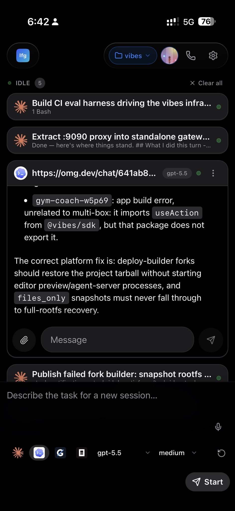
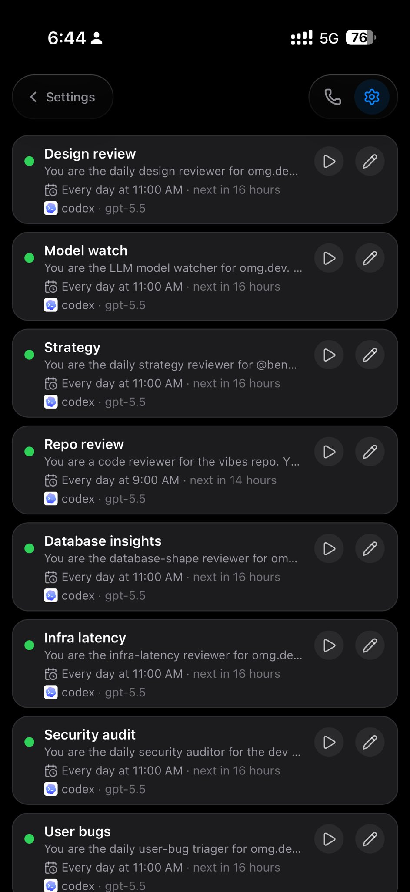
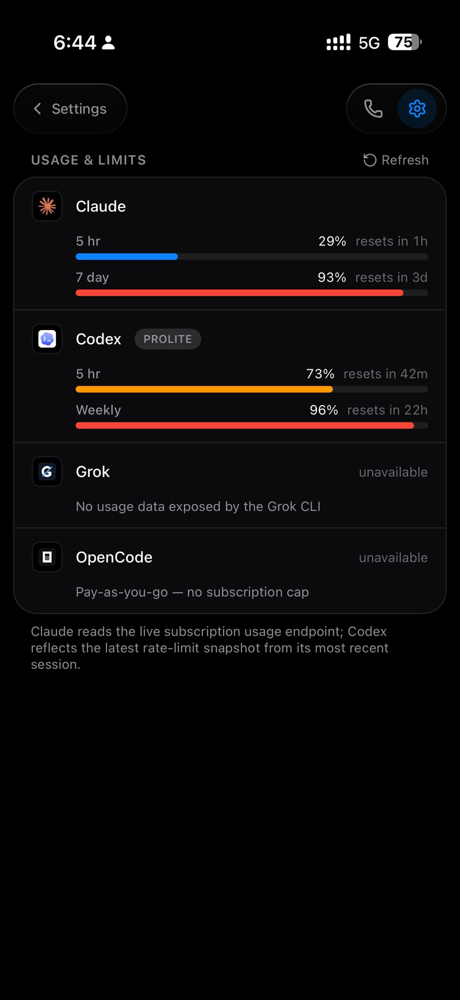

# lfg

Run AI coding agents on your own machine, from anywhere.

[](https://lfg.apps.omg.dev)

`lfg` turns a Linux box or macOS workstation into a private control plane for
Claude Code, Codex, and opencode. It starts each agent in a long-lived `tmux`
session, streams the transcript to a web UI, and lets you answer prompts or steer
work from your phone or laptop.

**Website:** [lfg.apps.omg.dev](https://lfg.apps.omg.dev)

## Why lfg?

- **Run agents where your code lives.** Sessions execute on your machine, in your
  repos, with your local CLIs and credentials.
- **Use a real web UI.** Launch sessions, watch output, answer permission
  prompts, switch projects, and resume work from an installable PWA.
- **Keep it private.** The server binds to loopback by default and is designed to
  be exposed through Tailscale, not the public internet.
- **Automate repo checks.** Optional markdown-defined agents can collect git,
  repo, GitHub, model, or security context and produce reports.

## Screenshots

<p>
  
  
  
</p>

The images are stored in this repo instead of hotlinked, so the README renders
reliably on GitHub.

## Requirements

- [Bun](https://bun.sh)
- `tmux`
- `git`
- At least one supported agent CLI on `PATH`:
  - `claude`
  - `codex`
  - `opencode`
- Optional: [Tailscale](https://tailscale.com) for private remote access

## Quick Start

Install on an Ubuntu/Debian VPS or macOS workstation:

```bash
curl -fsSL https://raw.githubusercontent.com/BennyKok/lfg/main/scripts/setup.sh | bash
```

For a non-interactive Tailscale setup:

```bash
TS_AUTHKEY=tskey-auth-xxxx \
  curl -fsSL https://raw.githubusercontent.com/BennyKok/lfg/main/scripts/setup.sh | bash
```

The setup script downloads the latest release, installs production dependencies,
writes `.env`, starts the server as a user service, and configures
`tailscale serve` when Tailscale is available.

## Local Development

```bash
git clone https://github.com/BennyKok/lfg.git
cd lfg
bun install
cp .env.example .env
bun run serve
```

Open `http://127.0.0.1:8766`.

Authenticate the agent CLI you want to use, for example by running `claude` once
and completing OAuth, or by setting the required API key in `.env`.

## Commands

```bash
bun run serve                  # web UI + control server
bun run agents -- list         # list markdown-defined agents
bun run agents -- run <name>   # run an insight agent
bun run whatsapp -- run        # optional WhatsApp sidecar
bun run setup                  # rerun provisioning/update flow
```

Installed release builds expose the same commands through `lfg`.

## Configuration

Configuration lives in `.env`; see [`.env.example`](./.env.example).

Common settings:

| Variable | Purpose |
| --- | --- |
| `LFG_HOST` | Bind address. Keep `127.0.0.1` unless you know the risk. |
| `LFG_PORT` | Web UI and API port. Defaults to `8766`. |
| `LFG_REPOS_ROOT` | Directory scanned for git repos. |
| `LFG_CLAUDE_PATH` | Override the `claude` binary path. |
| `LFG_CODEX_PATH` | Override the `codex` binary path. |
| `LFG_OPENCODE_PATH` | Override the `opencode` binary path. |
| `ANTHROPIC_API_KEY` | Optional API key for Claude SDK-backed flows. |
| `LFG_WHATSAPP_*` | Optional WhatsApp bridge settings. |

## Security

`lfg` launches AI agents with shell access on your machine. The control API is
unauthenticated by design because it is meant to run on loopback and be accessed
privately through Tailscale.

Do not expose `lfg` directly to the public internet. Read
[SECURITY.md](./SECURITY.md) before sharing access.

## Project Layout

```text
src/                 CLI, server, sessions, tmux, agents, integrations
web/                 React/Vite PWA
agents/              Example markdown-defined insight agents
scripts/setup.sh     Installer/provisioning script
scripts-internal/    Operator-only helpers (gitignored — see CONTRIBUTING.md)
deploy/              Optional voice, STT, Modal, and ops deployments
docs/                Notes, designs, and future public images
```

## Contributing

Issues and pull requests are welcome. Please read
[CONTRIBUTING.md](./CONTRIBUTING.md) and [SECURITY.md](./SECURITY.md) first.

## License

[MIT](./LICENSE)
